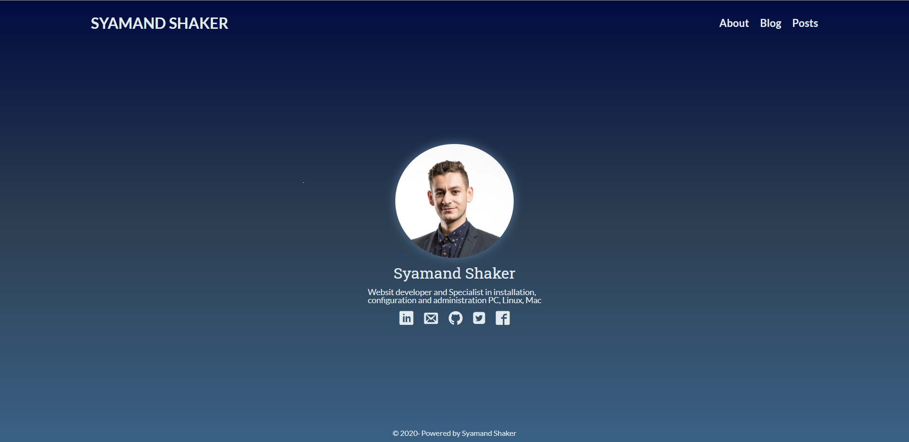
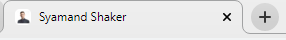
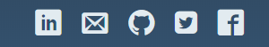

# THIS IS MY DEV-BLOG

This is my first project with **POWERCODERS** and inside I well put everything I learned in the class.

## MY FIRST WEB PAGE

  

  - This is the link to go to my website [here](https://syamandshaker.github.io/dev-blog/) :)

## WHAT CONTAINS MY REPOSITORY DEV-BLOG ?

 - My repository dev-blog contains two folder and three fils
 
        Here is the structure -->

 1. [assets](https://github.com/SyamandShaker/dev-blog/tree/gh-pages/assets) in this folder we find also fives folder

    - [css](https://github.com/SyamandShaker/dev-blog/tree/gh-pages/assets/css)
    In this folder I have main styling sheet **styles.css**

      - [styles.css](https://github.com/SyamandShaker/dev-blog/tree/gh-pages/assets/css/styles.css) They conatins my codes **CSS** that I use it for aall structures on my website.

    - [favicons](https://github.com/SyamandShaker/dev-blog/tree/gh-pages/assets/favicons) here we find the icons that I use it for my website.
      
          here is an exemple -->
  

        
  
    - [icons](https://github.com/SyamandShaker/dev-blog/tree/gh-pages/assets/icons) Here we find all icons I used it in my website so that you can contact me or you can see me on the social networks.
    
           Here is an exemple of this icons -->
  
         

    - [img](https://github.com/SyamandShaker/dev-blog/tree/gh-pages/assets/img) Here in this folder we have all images that i put it in my website. 
    
    -  [js](https://github.com/SyamandShaker/dev-blog/tree/gh-pages/assets/js) And here ! The last folder we can see all my code **JAVASCRIPT.**
  
    - [plugins](https://github.com/SyamandShaker/dev-blog/tree/gh-pages/assets/plugins) # here will put our third-party plugins like  "prismjs", "bootstrap", etc.
  
1. [posts](https://github.com/SyamandShaker/dev-blog/tree/gh-pages/posts) Here ! In the second folder I well put all my blog. 

2. [index.html](https://syamandshaker.github.io/dev-blog/index.html) This file conatins all my codes **HTML** and this is my first page on my website.

3. [about](https://syamandshaker.github.io/dev-blog/about.html) In this file html I will talking about myself, my  **HOW I AM ?** my CV and they well be my second page on my website.

4. [README.md](https://github.com/SyamandShaker/dev-blog) In this file I will introduce the structure of my repository **dev-blog** with **MARKDOWN** and this is the default page when you viewing on my repository **dev-blog.**
   
##  RESOURCES LINKS

    Here is some resources which helped me in the creation of my website --> 
- [GoHugo Themes](https://themes.gohugo.io/tags/blog/)
- [FreeCodeCamp](https://www.freecodecamp.org/)
- [Photopea](https://www.photopea.com/)
- [Favicon](https://realfavicongenerator.net/)
- [Iconmoon](https://icomoon.io/#home)
- [Online Image Converter](https://www.img2go.com/)
